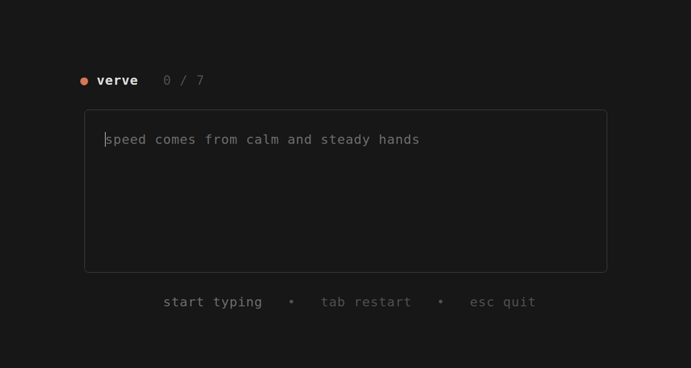
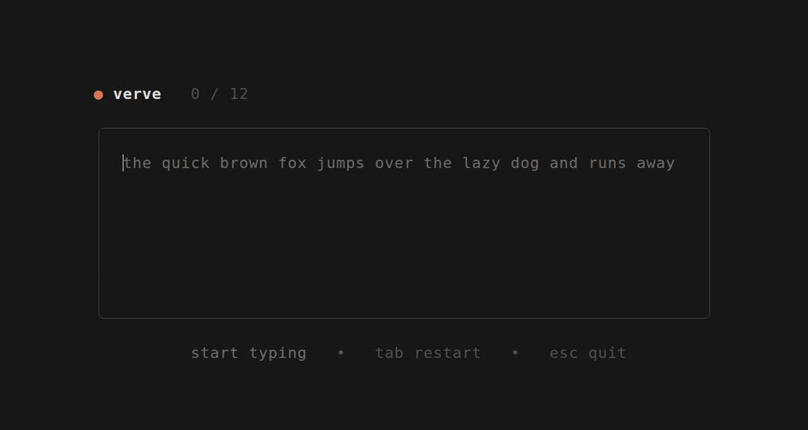

<h1 align="center">verve</h1>

<p align="center">A minimalist typing speed test that lives in your terminal.</p>

<p align="center">
  
  
  
  
</p>

<p align="center">
  
</p>

`verve` measures how fast you type without ever leaving the terminal. Words
appear, you type, and every character lights up as you go — text for the ones
you nailed, red underline for the misses. It tracks your best run of the session
and throws a little confetti when you beat it.

## Features

- Real-time, per-character feedback as you type
- Live WPM and timer while typing; WPM, accuracy and time on finish
- Session best score, with a confetti celebration on a new record
- Random words from a curated word list, or your own custom text
- A single, self-contained binary — instant startup, no config files

<p align="center">
  
</p>

## Installation

`verve` is written in Rust and compiles to one self-contained binary that runs
on Linux, macOS and Windows. You'll need the [Rust toolchain](https://rustup.rs).

```sh
# install the `verve` binary straight from the repo
cargo install --git https://github.com/vinicsperes/verve
```

Or build from a local clone:

```sh
git clone https://github.com/vinicsperes/verve.git
cd verve
cargo install --path .   # add `verve` to your PATH
# or just try it without installing:
cargo run --release
```

## Usage

```sh
verve                          # 25 random words
verve -w 50                    # 50 random words
verve -t "the quick brown fox" # type a fixed text
verve --help                   # all options
```

| Flag                | Description                                   |
| ------------------- | --------------------------------------------- |
| `-w, --words <n>`   | number of random words (default: 25)          |
| `-t, --text <text>` | type a fixed text instead of random words     |
| `-h, --help`        | show help                                      |

## Controls

| Key                | Action      |
| ------------------ | ----------- |
| any letter         | type        |
| `backspace`        | delete      |
| `ctrl`+`backspace` | delete word |
| `tab`              | restart     |
| `esc`              | quit        |

## How scoring works

- **WPM** is `(correct characters / 5) / minutes`, using the standard five-character
  word — the same definition sites like Monkeytype use. Only correct characters count.
- **Accuracy** is correct characters over characters typed.
- The **best score** is saved per word count and persists across sessions. Custom-text
  runs (`--text`) are tracked only for the current session.

## License

[MIT](LICENSE)
